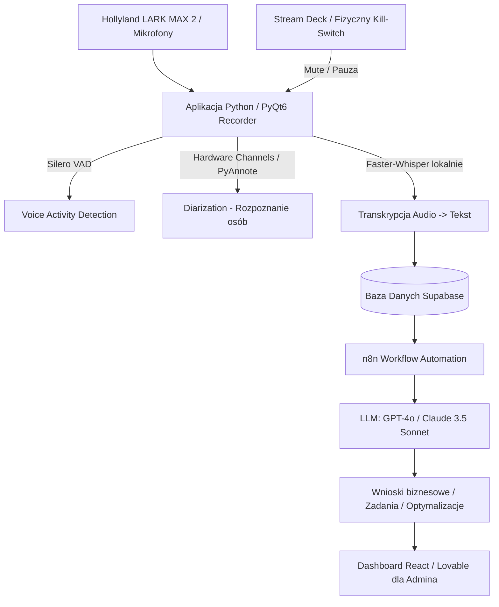

# Projekt: Inteligentny Asystent Biurowy AI (Ambient AI & Recorder)

> **UWAGA:** Niniejszy dokument stanowi żywe źródło wiedzy i celów projektowych (Project Memory / Agent Context). Może być modyfikowany, rozszerzany i aktualizowany w trakcie rozwoju projektu wraz ze zmianą wymagań lub założeń architektonicznych.

---

## 1. Główny Cel Projektu (Objective)
Budowa systemu **Ambient AI** dla biura, który w sposób ciągły i inteligentny:
1. Rejestruje mowę z mikrofonów w biurze (z automatycznym pomijaniem ciszy / VAD oraz fizycznym wyłącznikiem prywatności).
2. Rozpoznaje kto co mówi (diaryzacja mówców / dedykowane kanały audio na osobę).
3. Transkrybuje mowę lokalnie (za darmo, szybko i prywatnie przez Whisper / Faster-Whisper).
4. Przesyła dane do bazy danych (Supabase) z zachowaniem ścisłych ról dostępu (tylko administrator).
5. Wykorzystuje zaawansowane modele AI (np. przez automatyzację n8n -> GPT-4o / Claude 3.5 Sonnet) do ciągłej analizy rozmów biznesowych:
   - Wyciąganie zadań i deklaracji z przypisaniem do osób.
   - Identyfikacja wąskich gardeł i problemów procesowych.
   - Sugestie optymalizacji pracy biura.
   - Prezentacja wniosków na dedykowanym dashboardzie.

---

## 2. Aktualny Sprzęt Testowy
- **Mikrofony:** **Hollyland LARK MAX 2 Combo (4-person)** (bezprzewodowy zestaw wielomikrofonowy z przypięciem do osób).
- **Zastosowanie sprzętu:** Pozwala na przypisanie fizycznego mikrofonu/kanału do konkretnego pracownika, co umożliwia bezbłędną separację mówców (Hardware-based Diarization) oraz doskonałą jakość dźwięku bez pogłosu pomieszczenia.

---

## 3. Architektura Systemu i Komponenty

---

## 4. Status Realizacji: Co jest ZROBIONE vs Co jest DO ZROBIENIA

### ✅ ZROBIONE (Stan obecny w repozytorium):
- [x] **Aplikacja Desktopowa GUI (PyQt6)**: Nowoczesny interfejs, wskaźniki poziomu VU meter, zegar nagrywania, zarządzanie plikami nagrań i transkrypcji.
- [x] **Silero VAD (Voice Activity Detection)**: Detekcja mowy AI w czasie rzeczywistym, bufor 0.2s pre-padding (brak ucinania słów), regulowany suwak odcinania ciszy (1–10s, domyślnie 5s), auto-pauza i auto-wznawianie.
- [x] **Lokalna Transkrypcja na Żywo i po nagraniu**: Silnik `faster-whisper` z możliwością wyboru modelu w UI (`small`, `medium`, `large-v3-turbo`, `large-v3`, `base`), automatycznym wykrywaniem akceleracji sprzętowej (CUDA `float16` lub CPU `int8` z przydziałem wątków), zoptymalizowanymi parametrami Silero VAD (`threshold=0.3`, `speech_pad_ms=400`) oraz bezpiecznym fallbackiem słów zapobiegającym utracie wypowiedzi z początku nagrania.
- [x] **Transkrypcja i Diaryzacja po zakończeniu nagrania**: Integracja z `pyannote.audio` (model `pyannote/speaker-diarization-3.1`) + `faster-whisper`, łączenie segmentów słów z etykietami mówców.
- [x] **Filtrowanie i selekcja urządzeń wejściowych**: Wykrywanie sprawnych mikrofonów w Windows z pomijaniem niestabilnych sterowników WDM-KS.
- [x] **Wgrywanie Gotowych Plików Audio (WAV / MP3 / M4A / FLAC / OGG / AAC)**: Wgrywanie zewnętrznych nagrań ze spotkań lub dyktafonów, inteligentny miks kanałów stereo i normalizacja głośności (Peak Normalization), automatyczna konwersja do 16kHz mono bez potrzeby systemowego FFmpeg, asynchroniczna transkrypcja Whisper + diaryzacja PyAnnote (`batch_size=32`), podgląd w oknie i zapis do `.txt`.
- [x] **Panel Mapowania i Autosugestii Mówców (Speaker Mapping & Verification)**: Automatyczna analiza kontekstu dialogów w celu sugerowania imion (np. Jan, Piotr, Tomasz), wbudowany panel weryfikacji z próbkami wypowiedzi, możliwość szybkiej korekty w GUI oraz natychmiastowe przemapowanie w tekście i pliku `.txt`.
- [x] **Eksport lokalny**: Automatyczny zapis nagrań `.wav` i plików transkrypcji `.txt`.

---

- [x] **Separacja i Rozpoznawanie Mówców (Diarization)**:
  - W oparciu o testy sprzętu Hollyland LARK MAX 2 w systemie Windows (brak 4 fizycznych niezależnych kanałów USB) wdrożono i zoptymalizowano programową diaryzację AI `pyannote.audio` (`batch_size=32`) z panelem autosugestii imion i weryfikacji w GUI.

- [ ] **Globalny / Fizyczny Kill-Switch (Przycisk Prywatności)**:
  - Obsługa globalnych skrótów klawiszowych (działających w tle).
  - Integracja ze Stream Deck / przyciskiem USB / webhookiem lokalnym do natychmiastowego wyciszania/zatrzymywania nasłuchu.
- [ ] **Integracja z Supabase**:
  - Konfiguracja klienta Supabase w Pythonie.
  - Tabela na transkrypcje (kolumny: `id`, `session_id`, `speaker`, `channel`, `timestamp`, `content`, `audio_url`, `created_at`).
  - Zabezpieczenia RLS (Row Level Security) – dostęp wyłącznie dla roli administratora.
- [ ] **Automatyzacja n8n & Analiza AI**:
  - Przygotowanie workflow w n8n wyzwalanego cyklicznie (np. co godzinę lub na koniec dnia roboczego).
  - Prompt analityczny biznesowy (zadania, przypisane osoby, wąskie gardła, sugestie optymalizacyjne, odsiewanie rozmów prywatnych/luźnych).
- [ ] **Panel / Dashboard (React / Lovable)**:
  - Wizualizacja wyciągniętych wniosków, listy zadań i podsumowań dnia dla zarządu/administratora.
- [ ] **Zgodność i Procedury (RODO / Prywatność)**:
  - Informowanie osób w biurze o monitorowaniu procesów i statusie działania mikrofonów.

---

## 5. Instrukcja dla Agentów AI pracujących nad projektem
1. Przy kolejnych zadaniach sprawdzaj ten plik (`PROJECT_GOAL.md`) jako punkt odniesienia do bieżącej architektury i priorytetów.
2. Wszelkie zmiany założeń, nowe moduły lub nowe testowane urządzenia należy dopisywać i aktualizować w tym pliku.
